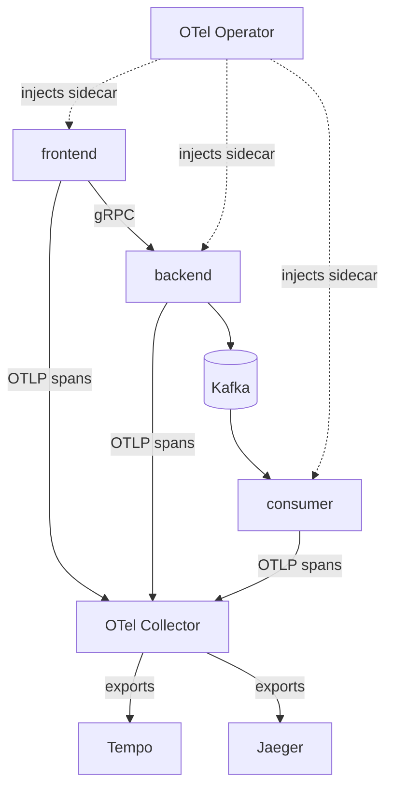
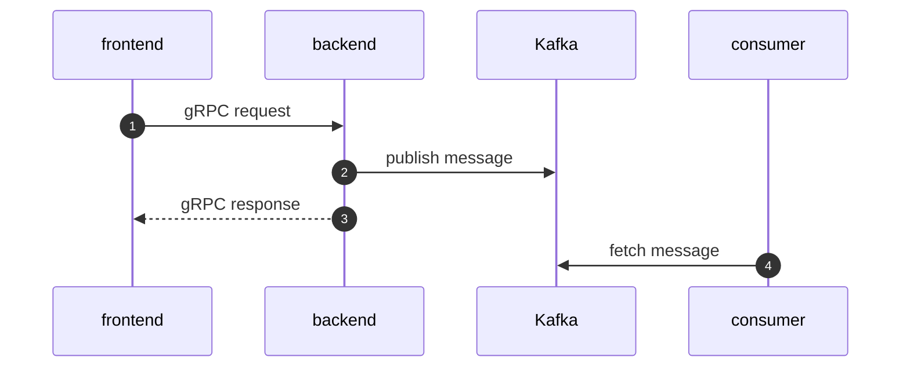
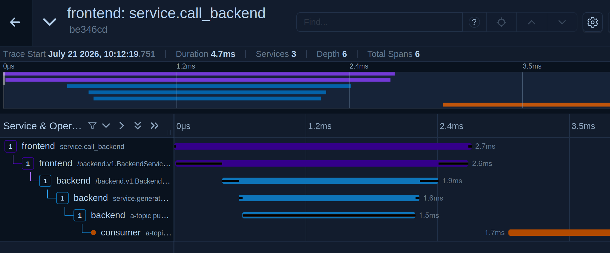
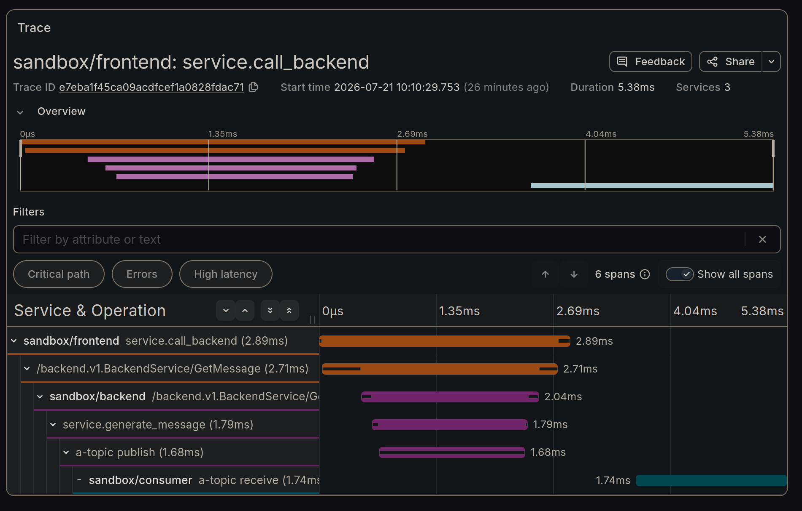
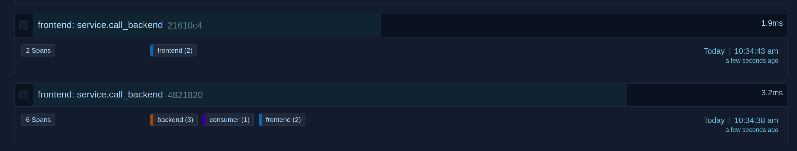
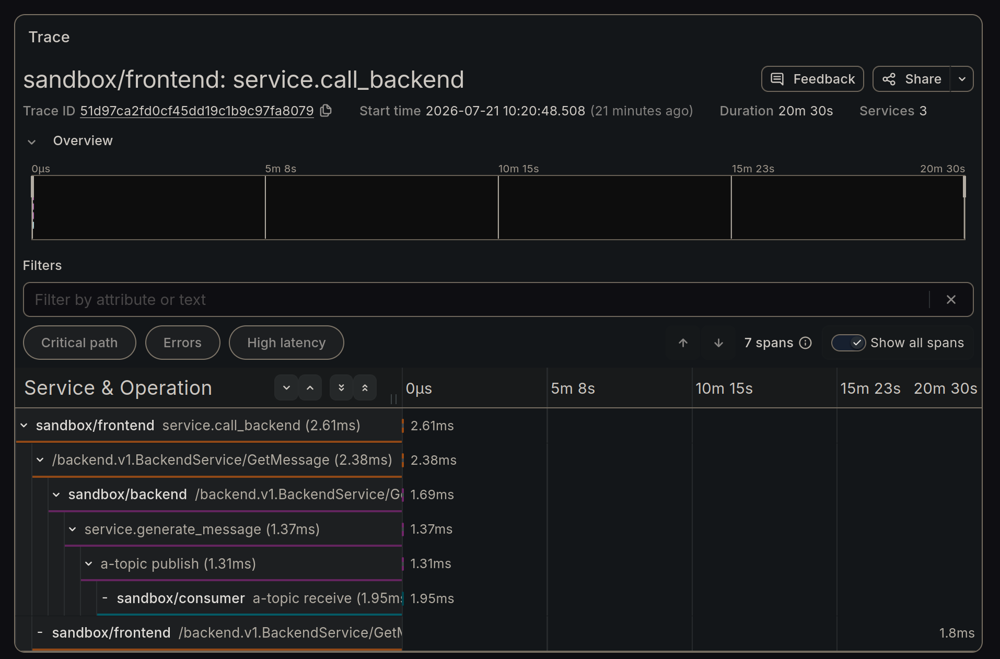
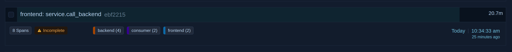
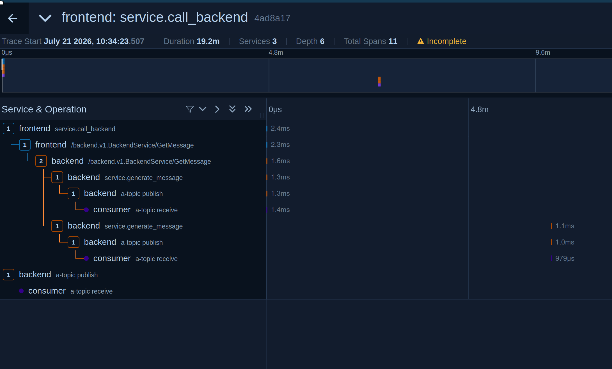

# OpenTelemetry Go Auto-Instrumentation Sandbox

Personal playground for OTEL Go auto-instrumentation.

> [!CAUTION]
> _This repo is intentionally permanently a work in progress, 
> sometimes intentionally shitty, and not to be used as an example of how to do anything._

> [!IMPORTANT]
The [opentelemetry-go-instrumentation](https://github.com/open-telemetry/opentelemetry-go-instrumentation) 
project, while not explicitly marked as "experimental", is noted to be a "work in progress"
and has no stable release.

## TL;DR
This sandcastle concludes that while the Go eBPF auto-instrumentation is interesting,
it seems to suffer from fragility possibly inherent to it's design, which relies on
memory layouts and goroutine mapping. Further investigation might reveal ways around
some of these issues but this is mostly a usability check.

While in its current state it is useful for gathering timings of network calls,
for its primary use case of distributed tracing it appears insufficiently reliable.
I would still highly recommend manual tracing using the SDK where this is an option.

## Sandbox Architecture



### Sandbox Service Test Flow




## eBPF auto-instrumentation findings

### Wall clock shenanigans

Originally this sandbox used `microk8s` but the eBPF auto-instrumentation
uses a kernel wall clock that does not take suspension time into account.
As such, the Go SDK reported time and eBPF auto-instrumented time were
off by the accumulated time my workstation had been suspended since last
restart, which added up to 11 days. Moving to KVM + Talos solved this.

Not something you would encounter in many production deployments.

### Version sensitivity

The eBPF auto-instrumentation is sensitive to memory layout and internal
library structures. It does not use only public package APIs, so even patch
releases can break tracing.

In this sandbox, `frontend` and `backend` communicate using gRPC. I had to
pin `google.golang.org/grpc` to `v1.82.0` because `v1.82.1` did not (yet)
work with `v0.24.0` of the Go auto-instrumentation image.

For production deployments, you likely want multiple `Instrumentation` CRs
for different runtime/library combinations.

## Context propagation issues

Current contrived flow:

- `frontend` sends a gRPC request to `backend` every 5 seconds
- `backend` responds to `frontend`, and also publishes a Kafka message
- `consumer` reads and logs the Kafka message (arguably out-of-band)

This is what we want to see in Jaeger and Tempo respectively:




### Observations

1. all `backend` spans stop being collected a couple of minutes
  after a cold boot of the cluster -- restarting the backend restores that
  for a short while



2. things can get very confused with messed up parent/child relations
  and traces being "incomplete".





3. things _can_ work correctly - whether those are lucky flukes or if it can
  be made stable is the question

### Context

- the fontend is auto-instrumented, _but_ it manually starts the first trace
  (`service.call_backend`)
- the frontend gRPC is *not* using the `otelgrpc` interceptor
- it is the auto-instrumentation which manages to _consistently_ create the
  grpc child span
- the second observation looks like infrastructure failure although obvious
  culprits (sidecar, `backend`, collector) all seem fine
- the Kafka messages produced by `backend` correctly have a `traceparent` header

Note that `backend` stats a span and then _intentionally_ relies on the auto-instrumentation
to propagate that context (`services/backend/main.go`):

```go
	// Check: we do not use the created context but because the auto-instrumentation uses goroutine
	// mapping to propagate the span context, the below Kafka MAY still become a child span of the GetMessage span.
	_, span := tracer.Start(ctx, "service.generate_message")
	defer span.End()
```

We can clearly see in the happy path that this at least actually works are expected (`a-topic publish` is 
implicitly a child of `service.generate_message`).
